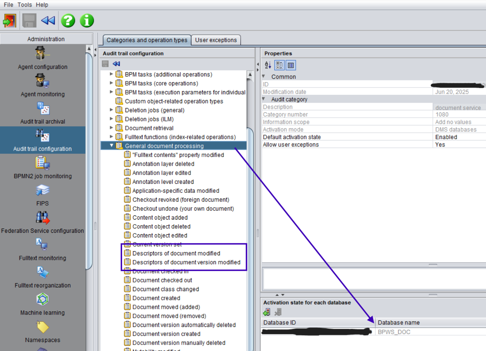
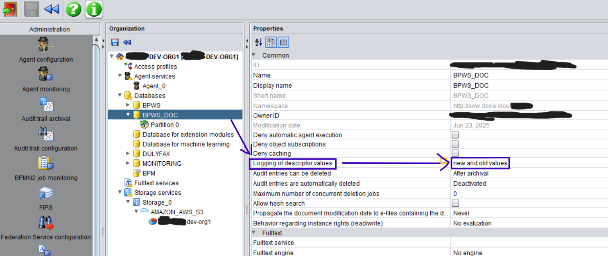
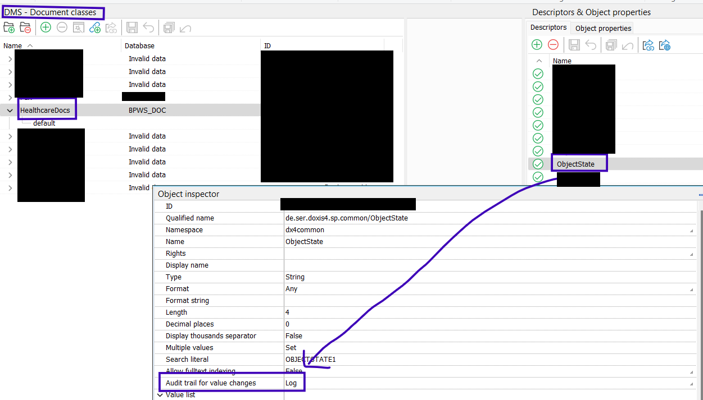
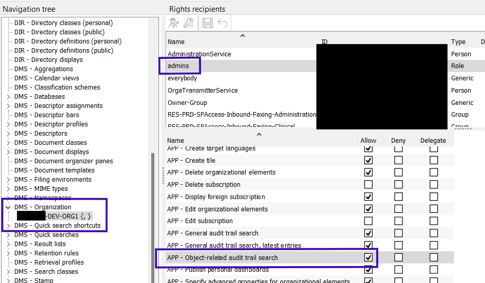
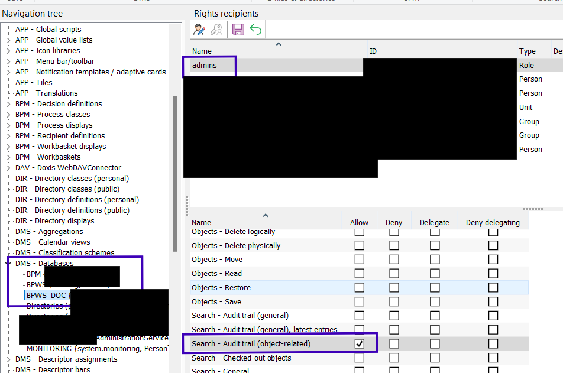
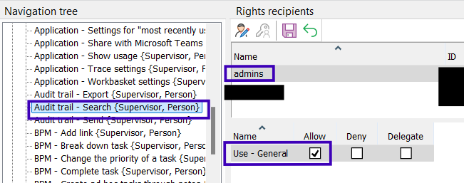
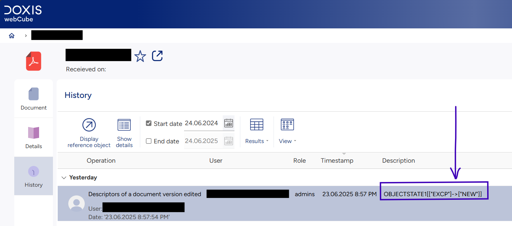

1. Admin Client - Add database of object class which descriptor to audit in the Audit Trail configuration module  
   

2. Admin Client - Select new and old values to Logging of descriptor values of the database specified in #1  
   

3. cubeDesigner - In the object class, select the descriptor to audit and set the value of Audit trail for value changes to Log  
   

4. cubeDesigner - Rights. DMS - Organization, APP - Object-related audit trail search  
   

5. cubeDesigner - Rights. DMS - Database, Search - Audit trail (object-related)  
   

6. cubeDesigner - Rights. APP - Menu bar / toolbar, Audit Trail - Search  
   

7. webCube – On the document with the descriptor updated, use the history component to view the audit trail.  
   
