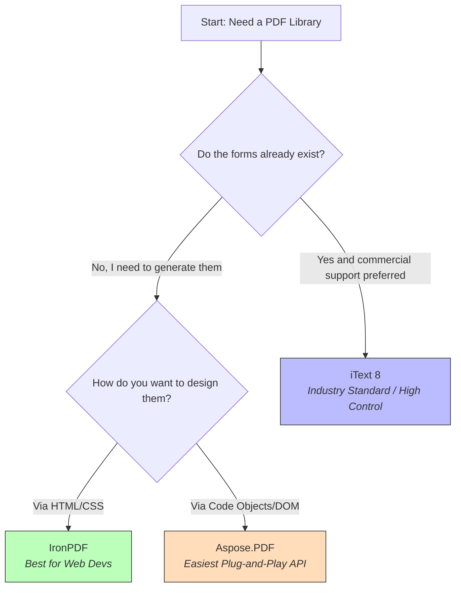

This markdown is designed for a quick GitHub README or internal Wiki. It uses a **Mermaid** flowchart to help your team decide on a library in seconds.

---

# 📑 Java/Groovy PDF Form Automation: Choosing Your Library

This guide helps you select the right commercial library for programmatically filling, creating, and reading PDF `AcroForms`.

## 🛠 Selection Logic


---

## 📋 Quick Comparison

| Library | Primary Strength | Best For... |
| --- | --- | --- |
| **iText 8** | Deep PDF manipulation & security | Complex enterprise workflows, Digital Signatures. |
| **Aspose.PDF** | Simple "Object-based" API | Rapidly mapping DB fields to PDF fields with minimal code. |
| **IronPDF** | HTML $\rightarrow$ Fillable PDF | Developers who want to design forms using standard Web tools. |

---

## 🚀 Integration Snippets (Groovy/Java)

### 1. The "Read" Loop (Aspose/iText Style)

Use this to ingest data after a user submits a form.

```groovy
// Example: Iterating through user-filled fields
def form = pdfDocument.getForm()
form.getFields().each { field ->
    println "Key: ${field.getPartialName()} | Value: ${field.getValue()}"
}

```

### 2. The "Fill" Action (IronPDF/HTML Style)

Use this to create a form from scratch without using Adobe Acrobat.

```html
<form>
  <label>First Name:</label>
  <input type="text" name="first_name" value="Pre-filled Name">
</form>

```

*When converted via **IronPDF**, the `<input>` becomes a native PDF interactive field automatically.*

---

## 💡 Pro-Tips

* **Field Naming:** Always use "CamelCase" or "Snake_Case" for your PDF field IDs in the GUI (e.g., `user_email`). Avoid spaces.
* **Flattening:** If you want to "lock" the PDF so the user cannot change the data after you've filled it, call the `.flatten()` method provided by these libraries.
* **Licensing:** All three offer free trials. Ensure you check the **AGPL vs. Commercial** requirements for iText 8 specifically.

---
