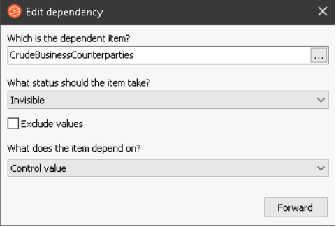

The dropdown control, `Counterparty` is actually two separate downdown lists. When the dialog is first drawn, both dropdown lists are invisible. Either appears depending on whether LNG is selected for `Desk`.
This behavior is achieved by creating dependencies on the dialog through cubeDesigner. 

Create the dependency

Create the rule

Remember to create a converse dependency for the other dropdown list so that when one appears, the other dissapears. Save and relogin webCube to test.
