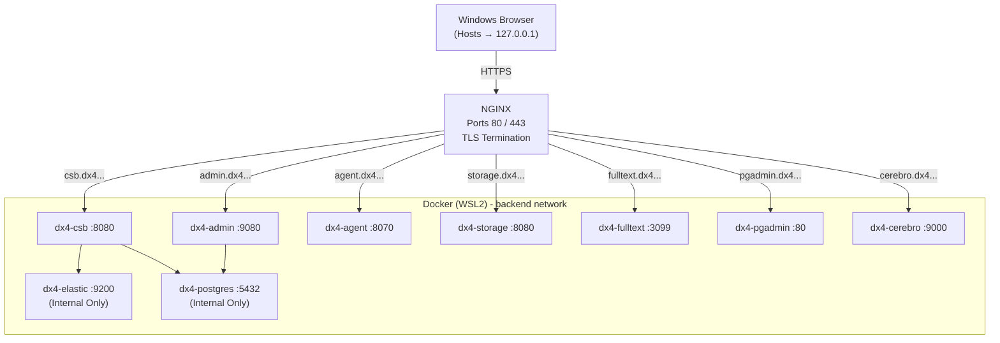

# Doxis Local SSL-Protected Single-Node Docker Deployment

## Overview

This document describes a production-safe, single-node deployment of the Doxis-CSB stack using Docker inside WSL2 (Fedora) on a Windows 11 host.

The design emphasizes:

* Reverse proxy via NGINX
* TLS termination at NGINX
* Internal-only PostgreSQL and Elasticsearch
* Subdomain routing (no subpaths)
* Single Docker bridge network
* No direct container port exposure except NGINX
* Production-grade security headers
* Windows hosts-file based local development

---

## Architecture Summary

```
Windows Browser
    │
    │ 127.0.0.1 mapping via hosts file
    ▼
WSL2 Docker Engine
    │
    ▼
NGINX (Ports 80 / 443)
    │
    ▼
Docker backend network
    ├── dx4-csb
    ├── dx4-admin
    ├── dx4-agent
    ├── dx4-storage
    ├── dx4-fips
    ├── dx4-fulltext
    ├── dx4-elastic (internal)
    ├── dx4-postgres (internal)
    ├── pgadmin
    └── cerebro
```

## Architecture Diagram


---

## Runtime Environment

* Windows 11 host

* Docker running inside WSL2 (Fedora)

* Local access via Windows `hosts` file:

  ```
  127.0.0.1 csb.***REMOVED***.duckdns.org
  127.0.0.1 admin.***REMOVED***.duckdns.org
  127.0.0.1 agent.***REMOVED***.duckdns.org
  127.0.0.1 storage.***REMOVED***.duckdns.org
  127.0.0.1 fulltext.***REMOVED***.duckdns.org
  127.0.0.1 pgadmin.***REMOVED***.duckdns.org
  127.0.0.1 cerebro.***REMOVED***.duckdns.org
  ```

* TLS certificates mounted from:

  ```
  /etc/letsencrypt
  ```
  * If you need a guide to get a free public certificate, follow this [guide](../../FreePublicCert.md) and when done, return to this point and resume.
    * The guide does not tell you to restart NGINX when the certificates are renewed. You can set up your environment to auto restart NGINX everytime [`certbot` renews the certificate with](../../FreePublicCert.md#8%EF%B8%8F%E2%83%A3-automatic-renewal)
       ```bash
       certbot renew --quiet --deploy-hook "docker compose restart nginx"
       ```         
---

# Docker Compose Configuration

## Design Principles

* Only NGINX publishes ports (80 and 443).
* PostgreSQL and Elasticsearch are internal only.
* All containers share a single bridge network: `backend`.
* Services communicate using Docker DNS names.

---

## docker-compose.yml

```yaml
version: "3.9"

services:

  ##############################################################
  # Reverse Proxy (SSL Termination)
  ##############################################################
  nginx:
    image: nginx:1.25-alpine
    container_name: dx4-nginx
    restart: unless-stopped
    ports:
      - "80:80"
      - "443:443"
    volumes:
      - ./nginx/nginx.conf:/etc/nginx/nginx.conf:ro
      - ./nginx/conf.d:/etc/nginx/conf.d:ro
      - ./nginx/auth:/etc/nginx/auth:ro
      - /etc/letsencrypt:/etc/letsencrypt:ro
    networks:
      - backend
    depends_on:
      - dx4-csb
      - dx4-admin
      - dx4-agent
      - dx4-storage
      - dx4-fips
      - dx4-fulltext
      - pgadmin
      - cerebro

  ##############################################################
  # PostgreSQL (Internal Only)
  ##############################################################
  dx4-postgres:
    image: postgres:15
    container_name: dx4-postgres
    restart: unless-stopped
    environment:
      POSTGRES_PASSWORD: postgres
    volumes:
      - dx4PostgresData:/var/lib/postgresql/data
    networks:
      backend:
        aliases:
          - dx4postgres
          - dx4-postgres
    healthcheck:
      test: ["CMD-SHELL", "pg_isready -U postgres"]
      interval: 10s
      timeout: 5s
      retries: 5

  ##############################################################
  # Elasticsearch (Internal Only)
  ##############################################################
  dx4-elastic:
    image: dx4-elastic:latest
    container_name: dx4-elastic
    restart: unless-stopped
    env_file:
      - dx4-csb.env
    networks:
      - backend
    volumes:
      - dx4ElasticData:/home/doxis4/dx4ElasticData
    healthcheck:
      test: ["CMD", "wget", "--no-proxy", "-O", "/dev/null", "http://localhost:9200/_cluster/health"]
      interval: 30s
      timeout: 5s
      retries: 5

  ##############################################################
  # DX4 Core Services
  ##############################################################
  dx4-csb:
    image: dx4-csb:latest
    container_name: dx4-csb
    restart: unless-stopped
    env_file:
      - dx4-csb.env
    networks:
      - backend
    depends_on:
      dx4-postgres:
        condition: service_healthy
      dx4-elastic:
        condition: service_healthy

  dx4-admin:
    image: dx4-admin:latest
    container_name: dx4-admin
    restart: unless-stopped
    env_file:
      - dx4-csb.env
    networks:
      - backend
    depends_on:
      - dx4-csb

  dx4-agent:
    image: dx4-agent:latest
    container_name: dx4-agent
    restart: unless-stopped
    env_file:
      - dx4-csb.env
    networks:
      - backend

  dx4-storage:
    image: dx4-storage:latest
    container_name: dx4-storage
    restart: unless-stopped
    env_file:
      - dx4-csb.env
    networks:
      - backend

  dx4-fips:
    image: dx4-fips:latest
    container_name: dx4-fips
    restart: unless-stopped
    env_file:
      - dx4-csb.env
    networks:
      - backend

  dx4-fulltext:
    image: dx4-fulltext:latest
    container_name: dx4-fulltext
    restart: unless-stopped
    env_file:
      - dx4-csb.env
    networks:
      - backend

  ##############################################################
  # pgAdmin
  ##############################################################
  pgadmin:
    image: dpage/pgadmin4:8
    container_name: dx4-pgadmin
    restart: unless-stopped
    environment:
      PGADMIN_DEFAULT_EMAIL: admin@***REMOVED***.duckdns.org
      PGADMIN_DEFAULT_PASSWORD: ppp
      PGADMIN_CONFIG_PROXY_X_FOR_COUNT: '1'
      PGADMIN_CONFIG_PROXY_X_PROTO_COUNT: '1'
      PGADMIN_CONFIG_PROXY_X_HOST_COUNT: '1'
    volumes:
      - pgadminData:/var/lib/pgadmin
    networks:
      - backend

  ##############################################################
  # Cerebro
  ##############################################################
  cerebro:
    image: lmenezes/cerebro
    container_name: dx4-cerebro
    restart: unless-stopped
    networks:
      - backend

volumes:
  dx4PostgresData:
  dx4ElasticData:
  pgadminData:

networks:
  backend:
    driver: bridge
```

---

# NGINX Configuration

## nginx.conf

```nginx
user nginx;
worker_processes auto;

events {
    worker_connections 1024;
}

http {
    include /etc/nginx/mime.types;
    default_type application/octet-stream;

    sendfile on;
    keepalive_timeout 65;

    include /etc/nginx/conf.d/*.conf;
}
```

---

## Subdomain Reverse Proxy Configuration

Each service is exposed via its own subdomain.

Example pattern:

```nginx
server {
    listen 443 ssl;
    server_name admin.***REMOVED***.duckdns.org;

    ssl_certificate     /etc/letsencrypt/live/***REMOVED***.duckdns.org/fullchain.pem;
    ssl_certificate_key /etc/letsencrypt/live/***REMOVED***.duckdns.org/privkey.pem;

    proxy_http_version 1.1;

    proxy_set_header Host $host;
    proxy_set_header X-Real-IP $remote_addr;
    proxy_set_header X-Forwarded-For $proxy_add_x_forwarded_for;
    proxy_set_header X-Forwarded-Proto https;

    add_header X-Frame-Options SAMEORIGIN always;
    add_header X-Content-Type-Options nosniff always;
    add_header Referrer-Policy strict-origin-when-cross-origin always;

    location / {
        proxy_pass http://dx4-admin:9080;
    }
}
```

---

# Database Design

* PostgreSQL container: `dx4-postgres`
* Database: `dx4`
* Schemas:

  * `dx4_admin`
  * `dx4_man01`
* Each schema:

  * Owned by a matching database user
  * UTF-8 encoding required
* `deadlock_timeout` ≥ 30s

PostgreSQL is never exposed externally.

---

# Security Model

* Only NGINX publishes ports
* All services communicate internally
* TLS termination at reverse proxy
* Security headers enabled
* pgAdmin protected with HTTP Basic Authentication
* No database port exposure
* No Elasticsearch exposure

---

# Operational Commands

Start stack:

```bash
docker compose up -d
```

Stop stack:

```bash
docker compose down
```

Restart NGINX only:

```bash
docker compose restart nginx
```

---

# Design Decisions

| Decision                   | Rationale                            |
| -------------------------- | ------------------------------------ |
| Subdomain routing          | Cleaner, avoids proxy path rewriting |
| Single Docker network      | Simpler, sufficient for single-node  |
| No container port exposure | Reverse proxy only entry point       |
| TLS at NGINX               | Centralized certificate management   |
| Internal PostgreSQL        | Prevents accidental public exposure  |
| Healthchecks               | Ensure service readiness             |

---

# Result

You now have:

* Production-safe reverse proxy architecture
* Clean service segmentation
* Local dev convenience
* Stable internal-only database and search layer
* Subdomain-based access pattern

---
