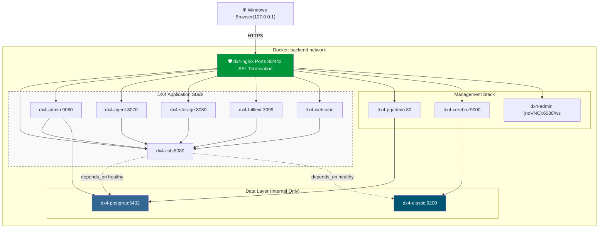

# Doxis Local SSL-Protected Single-Node Docker Deployment

## Overview

This document builds on the [publicly accessible Doxis CSB Docker guide](https://services.sergroup.com/documentation/#/view/PD_CSB_Short/14.3.1/en-us/DIG_Doxis_CSB/WEBHELP/index.html) and describes a production-like, single-node deployment of the Doxis-CSB stack using Docker inside WSL2 (Fedora) on a Windows 11 host.

The design emphasizes:

* Reverse proxy via NGINX
* TLS termination at NGINX
* Internal-only PostgreSQL and Elasticsearch
* Subdomain routing (no subpaths)
* Single Docker bridge network
* No direct container port exposure except NGINX
* Production-grade security headers
* Windows hosts-file based local development
* Doxis Admin Client GUI accessible through a web browser

__TLDR__: To skip right to how you should deploy on your own machine, jump tp the [Operational Commands](#operational-commands) section  

---

## Architecture Summary

```
Windows Browser
    │
    │ 127.0.0.1 mapping via hosts file
    ▼
WSL2 Docker Engine
    │
    ▼
NGINX (Ports 80 / 443)
    │
    ▼
Docker backend network
    ├── dx4-csb
    ├── dx4-admin (AdminServer + AdminClient via noVNC)
    ├── dx4-admin
    ├── dx4-storage
    ├── dx4-fips
    ├── dx4-fulltext
    ├── dx4-elastic (internal)
    ├── dx4-postgres (internal)
    ├── dx4-webcube
    ├── pgadmin
    └── cerebro
```

## Architecture Diagram


---

## Runtime Environment

* Windows 11 host

* Docker running inside WSL2 (Fedora)
  * See this [WSL2 configuration](.wslconfig) for VM tuning.

* Local access via Windows `hosts` file:

  ```
  127.0.0.1 dx4localdev.duckdns.org
  127.0.0.1 csb.dx4localdev.duckdns.org
  127.0.0.1 admin.dx4localdev.duckdns.org
  127.0.0.1 agent.dx4localdev.duckdns.org
  127.0.0.1 storage.dx4localdev.duckdns.org
  127.0.0.1 fulltext.dx4localdev.duckdns.org
  127.0.0.1 pgadmin.dx4localdev.duckdns.org
  127.0.0.1 cerebro.dx4localdev.duckdns.org
  127.0.0.1 adminclient.dx4localdev.duckdns.org
  ```

* TLS certificates mounted from:

  ```
  /etc/letsencrypt
  ```
  * If you need a guide to get a free public certificate, follow this [guide](../../FreePublicCert.md) and when done, return to this point and resume.
    * The guide does not tell you to restart NGINX when the certificates are renewed. You can set up your environment to auto restart NGINX everytime [`certbot` renews the certificate with](../../FreePublicCert.md#8%EF%B8%8F%E2%83%A3-automatic-renewal)
       ```bash
       certbot renew --quiet --deploy-hook "docker compose restart nginx"
       ```         
---

# Docker Compose Configuration

## Design Principles

* Only NGINX publishes ports (80 and 443).
* PostgreSQL and Elasticsearch are internal only.
* All containers share a single bridge network: `backend`.
* Services communicate using Docker DNS names.

---

## [docker-compose.yml](docker-compose.yml)
The [Docker Compose file provided by Doxis](https://services.sergroup.com/documentation/api/documentations/2/522/1528/WEBHELP/CSB/topics/reference-run-image-dockercompose.html) has been adpated to incorporate the changes described in this document is found in [docker-compose.yml](docker-compose.yml) in this directory. It has already incorporated Jira [SUPP-13793](https://ser-group.atlassian.net/browse/SUPP-13793?focusedCommentId=1231782).

---

# NGINX Configuration

## nginx/nginx.conf

```nginx
user nginx;
worker_processes auto;

events {
    worker_connections 1024;
}

http {
    include       /etc/nginx/mime.types;
    default_type  application/octet-stream;

    sendfile on;
    keepalive_timeout 65;

    # WebSocket upgrade mapping (must be inside http{} scope)
    map $http_upgrade $connection_upgrade {
        default upgrade;
        ''      close;
    }

    include /etc/nginx/conf.d/*.conf;
}
```

---

## Subdomain Reverse Proxy Configuration (nginx/conf.d/sample.conf)

Each service is exposed via its own subdomain.

Example pattern:

```nginx
server {
    listen 443 ssl;
    server_name admin.dx4localdev.duckdns.org;

    ssl_certificate     /etc/letsencrypt/live/dx4localdev.duckdns.org/fullchain.pem;
    ssl_certificate_key /etc/letsencrypt/live/dx4localdev.duckdns.org/privkey.pem;

    proxy_http_version 1.1;

    proxy_set_header Host $host;
    proxy_set_header X-Real-IP $remote_addr;
    proxy_set_header X-Forwarded-For $proxy_add_x_forwarded_for;
    proxy_set_header X-Forwarded-Proto https;

    add_header X-Frame-Options SAMEORIGIN always;
    add_header X-Content-Type-Options nosniff always;
    add_header Referrer-Policy strict-origin-when-cross-origin always;

    location / {
        proxy_pass http://dx4-admin:9080;
    }
}
```

Full sample is [dx4.conf](./dx4.conf) that includes a section for webCube that also allows WebSockets to be used.

---

### Admin Client via noVNC (adminclient.*)

The Doxis **Admin Client** (Swing GUI) runs **inside the existing `dx4-admin` container** (same container as AdminServer) and is exposed to browsers through **noVNC** over HTTPS. This avoids running a second `dx4-admin` container (CPU/RAM constraint).

Key points:

- New vhost: `adminclient.<domain>`
- Protected with **HTTP Basic Auth**
- WebSockets must be enabled (noVNC uses a WebSocket path, typically `/websockify`)
- The noVNC viewer page is typically `vnc.html`

Browser URL pattern:

- `https://adminclient.<domain>/vnc.html?autoconnect=1&path=websockify` (e.g., `https://adminclient.dx4local.duckdns.org/vnc.html?autoconnect=1&path=websockify`)

Troubleshooting tip (name-based TLS vhosts): testing with `https://localhost/...` can hit the *default* server block and return 404. To test the correct vhost locally, use curl with SNI/Host override:

```bash
curl -vk --resolve adminclient.<domain>:443:127.0.0.1 \
  "https://adminclient.<domain>/vnc.html?autoconnect=1&path=websockify"
```

---

# Database Design

* PostgreSQL container: `dx4-postgres`
* Database: `dx4`
* Schemas:

  * `dx4_admin`
  * `dx4_man01`
* Each schema:

  * Owned by a matching database user
  * UTF-8 encoding required
* `deadlock_timeout` ≥ 30s

PostgreSQL is never exposed externally.

Perform the [Postgres configuration step described by Doxis](https://services.sergroup.com/documentation/#/view/PD_CSB_Short/14.3.0/en-us/IG_Doxis_CSB/WEBHELP/APP_CSB/topics/top_InstallDB_PostgresIntro.html) or use this [dx4CreatePostgresSchema.psql](./dx4CreatePostgresSchema.psql) script to create the schemas. 
### Using the provided scripts
Note that the [script](./dx4CreatePostgresSchema.psql)  requires an existing database. The steps are:
1. Create the database first with the following command before running the [script](./dx4CreatePostgresSchema.psql).
   ```bash
   docker exec -it dx4-postgres psql -U postgres -d postgres -c "CREATE DATABASE dx4 WITH ENCODING 'UTF8' TEMPLATE template0;"
   ```
2. Copy the  [dx4CreatePostgresSchema.psql](./dx4CreatePostgresSchema.psql) into the postgres container.
   ```bash 
   docker cp ./dx4CreatePostgresSchema.psql dx4-postgres:/dx4CreatePostgresSchema.psql
   ```
3. Run the Doxis provided dx4CreatePostgresDB.sh bash script. You get this bash script from the [CSB Docker images](https://services.sergroup.com/documentation/#/view/PD_CSB_Short/14.3.1/en-us/DIG_Doxis_CSB/WEBHELP/index.html) distribution ISO/ZIP from Doxis.
   ```bash
   ./dx4CreatePostgresDB.sh
   ```

---

# Security Model

* Only NGINX publishes ports
* All services communicate internally
* TLS termination at reverse proxy
* Security headers enabled
* pgAdmin protected with HTTP Basic Authentication
* Admin Client (noVNC) protected with HTTP Basic Authentication
* No database port exposure
* No Elasticsearch exposure

---

# Operational Commands

1. Clone this GitHub repo
   ```bash
   git clone https://github.com/alf-wchong/SER-Doxis-CSB-Helper.git
   cd SER-Doxis-CSB-Helper
   ```
2. Update the Windows hosts file (so subdomains resolve locally)
   * Edit as Administrator:
     * `C:\Windows\System32\drivers\etc\hosts`
   * Add entries (adjust domain as needed) as shown in [Runtime Environment](#runtime-environment)

3. Mount the TLS certificates (Let’s Encrypt)
   * Ensure your certs exist on the Windows/WSL host at:

     * `/etc/letsencrypt`
     * If you need help getting a free public certificate, follow this [guide](../../FreePublicCert.md) and when done, return to this point and resume.
       * The guide does not tell you to restart NGINX when the certificates are renewed. You can set up your environment to auto restart NGINX everytime [`certbot` renews the certificate with](../../FreePublicCert.md#8%EF%B8%8F%E2%83%A3-automatic-renewal)
         ```bash
         certbot renew --quiet --deploy-hook "docker compose restart nginx"
         ```
   * The compose file mounts it into nginx as:

     * `/etc/letsencrypt:/etc/letsencrypt:ro`

4. In the directory where [docker-compose.yml](docker-compose.yml) is, create the `dx4-csb.env` file using the values listed in the [Required environment variables](https://services.sergroup.com/documentation/api/documentations/2/522/1528/WEBHELP/CSB/topics/reference-run-image-docker.html#reference_run_image__available_docker_images) table published by Doxis.
     - To enable remote debugging for the [Agent Service](https://services.sergroup.com/documentation/#/view/PD_CSB_Short/14.3.0/en-us/IG_Doxis_CSB/WEBHELP/APP_CSB/topics/top_InstallCSB_AgentServiceIntro.html), specify the _JDWP agent configuration string_ in the `DX4_AGENTSERVER_JAVA_OPTS` entry in `dx4-csb.env`.
       ```plaintext
       DX4_AGENTSERVER_JAVA_OPTS=-agentlib:jdwp=transport=dt_socket,server=y,suspend=n,address=*:5005
       ```
       Though you may want to lock down access by specifying IPs rather than `*` for the `address`. For as Szczupakowski said, it's an access point into your Agent Service. 
       
        - Remember to expose the [JDWP](https://www.baeldung.com/java-application-remote-debugging?utm_source=chatgpt.com) port in the `dx4-agent` section of [docker-compose.yml](docker-compose.yml)
          ```yaml
              ports:
                - "5005:5005"
          ```     

4. Start __only__ the database (initial bootstrap)
   ```bash
   docker compose up -d dx4-postgres
   ```
5. Run the Postgres schema setup (choose one)
   - Complete the [postgres configuration step described by Doxis](https://services.sergroup.com/documentation/#/view/PD_CSB_Short/14.3.0/en-us/IG_Doxis_CSB/WEBHELP/APP_CSB/topics/top_InstallDB_PostgresIntro.html), **or**
   - Use the [provided scripts](#using-the-provided-scripts).
6. Build the enhanced Admin image (must be built **before** bringing up the full stack) using the [Dockerfile](dx4-admin-vnc/Dockerfile) in the [dx4-admin-vnc](./dx4-admin-vnc) directory
   ```bash
   docker build -t dx4-admin:14.3.1_vnc ./dx4-admin-vnc
   ```
   Start the rest of the stack
   ```bash
   docker compose up -d
   ```
7. Configure the Doxis system using the in-container Admin Client (via noVNC)
   - Open in browser:
     - `https://adminclient.<domain>/vnc.html?autoconnect=1&path=websockify`
       - (e.g., `https://adminclient.dx4local.duckdns.org/vnc.html?autoconnect=1&path=websockify`)
   - [Log into Admin Client]((https://services.sergroup.com/documentation/api/documentations/2/485/1482/WEBHELP/APP_CSB/topics/tsk_UserManual_AdminCltStartStop_Logon.html))
     - Configure [**domain**](https://services.sergroup.com/documentation/#/view/PD_CSB_Short/14.3.0/en-us/UG_Doxis_CSB/WEBHELP/APP_CSB/topics/top_UserManual_Superadmin_ChapIntro.html) and [**organization**](https://services.sergroup.com/documentation/#/view/PD_CSB_Short/14.3.0/en-us/UG_Doxis_CSB/WEBHELP/APP_CSB/topics/top_UserManual_Orgaadmin_ChapIntro.html) as required for your setup.
8. Run cubeDesigner once before using webCube
   - Launch cubeDesigner (>= 14.5.0) and log in to the system.
   - This allows security modules to be initialized automatically so the system becomes usable for development.
     - If you see in the webCube logs an error similar to `com.ser.sedna.client.bluelineimpl.exception.SEDNABlueLineException: SecurityType "MenuItems" is missing. System might not be initialized with Doxis4 cubeDesigner`, it is highly likely that either the cubeDesigner you used is older than webCube or the initial setup of the security modules wasn't completed by cubeDesigner. When cubeDesigner does this, it does so without notifying the user and it does take a few minutes so you have to be patient.

9. Access webCube
   - `https://<webcube-subdomain>.<domain>/` (as defined by your nginx vhost)
     - eg `https://dx4local.duckdns.org/webcube/`
10. Pause stack
     ```bash
     docker compose stop
     ```
11. Resume stack
    ```bash
    docker compose start
    ```
12. Destroy stack (**__Use with extreme caution, there is no going back__**)
    ```bash
    docker compose down -v
    ```

### Restarting the Admin Client without restarting the container

If you need to restart only the Swing Admin Client (not the whole `dx4-admin` container):

```bash
docker exec dx4-admin pkill -f DOXiS4CSBAdminClient || true
docker exec -d dx4-admin bash -lc 'export DISPLAY=:1; cd /home/doxis4/DOXiS4SoapAdminClient && ./DOXiS4CSBAdminClient'
```

Note: `docker exec` shells may not have `DISPLAY` set; exporting `DISPLAY=:1` ensures the client attaches to the Xvfb display used by noVNC.

---

# Design Decisions

| Decision                       | Rationale                            |
| --------------------------     | ------------------------------------ |
| Subdomain routing              | Cleaner, avoids proxy path rewriting |
| Single Docker network          | Simpler, sufficient for single-node  |
| No container port exposure     | Reverse proxy only entry point       |
| TLS at NGINX                   | Centralized certificate management   |
| Internal PostgreSQL            | Prevents accidental public exposure  |
| Healthchecks                   | Ensure service readiness             |
| Admin Client exposed with noVnc| Convenient all-in-one deployment     |

---

# Result

You now have:

* Production-safe reverse proxy architecture
* Clean service segmentation
* Local dev convenience
* Stable internal-only database and search layer
* Subdomain-based access pattern

---
