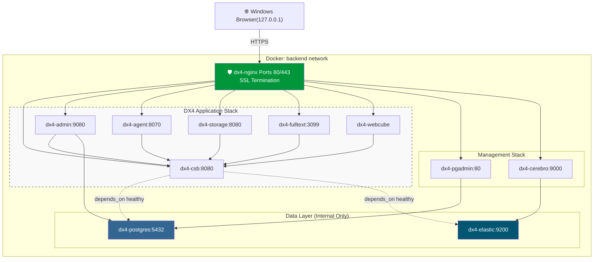

# Doxis Local SSL-Protected Single-Node Docker Deployment

## Overview

This document builds on the [publicly accessible Doxis CSB Docker guide](https://services.sergroup.com/documentation/#/view/PD_CSB_Short/14.3.1/en-us/DIG_Doxis_CSB/WEBHELP/index.html) and describes a production-like, single-node deployment of the Doxis-CSB stack using Docker inside WSL2 (Fedora) on a Windows 11 host.

The design emphasizes:

* Reverse proxy via NGINX
* TLS termination at NGINX
* Internal-only PostgreSQL and Elasticsearch
* Subdomain routing (no subpaths)
* Single Docker bridge network
* No direct container port exposure except NGINX
* Production-grade security headers
* Windows hosts-file based local development

---

## Architecture Summary

```
Windows Browser
    │
    │ 127.0.0.1 mapping via hosts file
    ▼
WSL2 Docker Engine
    │
    ▼
NGINX (Ports 80 / 443)
    │
    ▼
Docker backend network
    ├── dx4-csb
    ├── dx4-admin (AdminServer + AdminClient via noVNC)
    ├── dx4-agent
    ├── dx4-storage
    ├── dx4-fips
    ├── dx4-fulltext
    ├── dx4-elastic (internal)
    ├── dx4-postgres (internal)
    ├── dx4-webcube
    ├── pgadmin
    └── cerebro
```

## Architecture Diagram


---

## Runtime Environment

* Windows 11 host

* Docker running inside WSL2 (Fedora)
  * See this [WSL2 configuration](.wslconfig) for VM tuning.

* Local access via Windows `hosts` file:

  ```
  127.0.0.1 dx4localdev.duckdns.org
  127.0.0.1 csb.dx4localdev.duckdns.org
  127.0.0.1 admin.dx4localdev.duckdns.org
  127.0.0.1 agent.dx4localdev.duckdns.org
  127.0.0.1 storage.dx4localdev.duckdns.org
  127.0.0.1 fulltext.dx4localdev.duckdns.org
  127.0.0.1 pgadmin.dx4localdev.duckdns.org
  127.0.0.1 cerebro.dx4localdev.duckdns.org
  127.0.0.1 adminclient.dx4localdev.duckdns.org
  ```

* TLS certificates mounted from:

  ```
  /etc/letsencrypt
  ```
  * If you need a guide to get a free public certificate, follow this [guide](../../FreePublicCert.md) and when done, return to this point and resume.
    * The guide does not tell you to restart NGINX when the certificates are renewed. You can set up your environment to auto restart NGINX everytime [`certbot` renews the certificate with](../../FreePublicCert.md#8%EF%B8%8F%E2%83%A3-automatic-renewal)
       ```bash
       certbot renew --quiet --deploy-hook "docker compose restart nginx"
       ```         
---

# Docker Compose Configuration

## Design Principles

* Only NGINX publishes ports (80 and 443).
* PostgreSQL and Elasticsearch are internal only.
* All containers share a single bridge network: `backend`.
* Services communicate using Docker DNS names.

---

## docker-compose.yml
(Incorporating Jira [SUPP-13793](https://ser-group.atlassian.net/browse/SUPP-13793?focusedCommentId=1231782))
```yaml
##############################################################
# Production-Structured Single Node DX4 Deployment
#
# - SSL termination at NGINX
# - PostgreSQL internal only
# - Elasticsearch internal only
# - All other services reverse proxied
# - Vendor-compatible container names
# - Network segmentation (frontend / backend)
##############################################################

services:

  ##############################################################
  # Reverse Proxy (SSL Termination)
  ##############################################################
  nginx:
    image: nginx:1.25-alpine
    container_name: dx4-nginx
    restart: unless-stopped
    ports:
      - "80:80"
      - "443:443"
    volumes:
      - ./nginx/nginx.conf:/etc/nginx/nginx.conf:ro
      - ./nginx/conf.d:/etc/nginx/conf.d:ro
      - ./nginx/auth:/etc/nginx/auth:ro
      # Mount entire letsencrypt directory (live/* are symlinks into archive/*)
      - /etc/letsencrypt:/etc/letsencrypt:ro
    networks:
      - backend
    depends_on:
      - dx4-csb
      - dx4-admin
      - dx4-agent
      - dx4-storage
      - dx4-fulltext
      - pgadmin
      - cerebro

  ##############################################################
  # PostgreSQL (Internal Only)
  # Required container name: dx4-postgres
  ##############################################################
  dx4-postgres:
    image: postgres:15
    container_name: dx4-postgres
    restart: unless-stopped
    environment:
      POSTGRES_PASSWORD: ***REDACTED***
    volumes:
      - dx4PostgresData:/var/lib/postgresql/data
    networks:
      backend:
        aliases:
          - dx4postgres
          - dx4-postgres
    healthcheck:
      test: ["CMD-SHELL", "pg_isready -U postgres"]
      interval: 10s
      timeout: 5s
      retries: 5

  ##############################################################
  # Elasticsearch (Internal Only)
  ##############################################################
  dx4-elastic:
    image: dx4-elastic:latest
    container_name: dx4-elastic
    restart: unless-stopped
    env_file:
      - dx4-csb.env
    networks:
      backend:
        aliases:
          - dx4elastic
    volumes:
      - dx4ElasticData:/home/doxis4/dx4ElasticData
    healthcheck:
      test: ["CMD", "wget", "--no-proxy", "-O", "/dev/null", "http://localhost:9200/_cluster/health"]
      interval: 30s
      timeout: 5s
      retries: 5

  ##############################################################
  # DX4 Core Services (Backend + Frontend)
  ##############################################################

  dx4-csb:
    image: dx4-csb:latest
    container_name: dx4-csb
    restart: unless-stopped
    env_file:
      - dx4-csb.env
    networks:
      backend:
        aliases:
          - dx4csb
    depends_on:
      dx4-postgres:
        condition: service_healthy
      dx4-elastic:
        condition: service_healthy
    volumes:
      - type: volume
        source: dx4Shared
        target: /home/doxis4/shared
    healthcheck:
      test: ["CMD", "wget", "--no-proxy", "--spider", "http://localhost:8080/sedna-transfer-service-xf/isAlive"]
      start_period: 90s
      interval: 30s
      timeout: 10s
      retries: 3


dx4-admin:
  # Enhanced image: runs AdminServer + AdminClient (Swing) exposed via noVNC
  # Build locally before 'docker compose up -d':
  #   docker build -t dx4-admin:14.3.1_vnc ./dx4-admin-vnc
  image: dx4-admin:14.3.1_vnc
  container_name: dx4-admin
  restart: unless-stopped
  env_file:
    - dx4-csb.env
  environment:
    # Optional: set an additional VNC password layer (nginx basic-auth still applies)
    # VNC_PASSWORD: "change-me"
    # Optional display/window sizing
    # GEOMETRY: "1920x1080"
    # DEPTH: "24"
    # The VNC/noVNC stack typically uses X display :1
    DISPLAY: ":1"
  expose:
    # noVNC (HTTP) inside the backend network (nginx proxies to this)
    - "6080"
    # (Optional) raw VNC inside the backend network
    - "5900"
  networks:
    backend:
      aliases:
        - dx4admin
  depends_on:
    - dx4-csb
  volumes:
    - type: volume
      source: dx4Shared
      target: /home/doxis4/shared
  healthcheck:
    test: ["CMD", "wget", "--no-proxy", "--spider", "http://localhost:9080/isAlive"]
    start_period: 90s
    interval: 30s
    timeout: 10s
    retries: 3

  dx4-agent:
    image: dx4-agent:latest
    container_name: dx4-agent
    restart: unless-stopped
    env_file:
      - dx4-csb.env
    networks:
      backend:
        aliases:
          - dx4agent
    depends_on:
      - dx4-csb
    volumes:
      - type: volume
        source: dx4Shared
        target: /home/doxis4/shared
    healthcheck:
      test: ["CMD", "wget", "--no-proxy", "--spider", "http://localhost:8070/isAlive"]
      start_period: 90s
      interval: 30s
      timeout: 10s
      retries: 3

  dx4-storage:
    image: dx4-storage:latest
    container_name: dx4-storage
    restart: unless-stopped
    env_file:
      - dx4-csb.env
    networks:
      backend:
        aliases:
          - dx4storage
    depends_on:
      - dx4-csb
    volumes:
      - type: volume
        source: dx4Shared
        target: /home/doxis4/shared
      # Optional below: only if you use a file adapter
      - type: volume
        source: dx4Storage
        target: /home/doxis4/dx4Storage
    healthcheck:
      test: ["CMD", "wget", "--no-proxy", "--spider", "http://localhost:8080/storagesystem/isAlive"]
      start_period: 90s
      interval: 30s
      timeout: 10s
      retries: 3

  dx4-fulltext:
    image: dx4-fulltext:latest
    container_name: dx4-fulltext
    restart: unless-stopped
    env_file:
      - dx4-csb.env
    networks:
      backend:
        aliases:
          - dx4ft
    depends_on:
      - dx4-csb
    volumes:
      - type: volume
        source: dx4Shared
        target: /home/doxis4/shared
    healthcheck:
      test: ["CMD", "wget", "--no-proxy", "--spider", "http://localhost:3099/isAlive"]
      start_period: 90s
      interval: 30s
      timeout: 10s
      retries: 3

  ##############################################################
  # pgAdmin
  ##############################################################
  pgadmin:
    image: dpage/pgadmin4:8
    container_name: dx4-pgadmin
    restart: unless-stopped
    environment:
      PGADMIN_DEFAULT_EMAIL: admin@dx4localdev.duckdns.org
      PGADMIN_DEFAULT_PASSWORD: ***REDACTED***
      PGADMIN_CONFIG_PROXY_X_FOR_COUNT: "1"
      PGADMIN_CONFIG_PROXY_X_PROTO_COUNT: "1"
      PGADMIN_CONFIG_PROXY_X_HOST_COUNT: "1"
    volumes:
      - pgadminData:/var/lib/pgadmin
    networks:
      - backend

  ##############################################################
  # Cerebro (Elastic UI)
  ##############################################################
  cerebro:
    image: lmenezes/cerebro
    container_name: dx4-cerebro
    restart: unless-stopped
    environment:
      CEREBRO_PORT: 9000
    networks:
      - backend

  ##############################################################
  # webCube (Doxis UI)
  ##############################################################
  dx4-webcube:
    image: dx4-webcube:14.3.1
    container_name: dx4-webcube
    restart: unless-stopped
    networks:
      backend:
        aliases:
          - dx4webcube
    env_file:
      - dx4-webcube.env
    volumes:
      - type: volume
        source: dx4Shared
        target: /home/doxis4/shared
    healthcheck:
      test: ["CMD", "wget", "--no-proxy", "--spider", "http://localhost:8080/webcube/admin"]
      start_period: 90s
      interval: 30s
      timeout: 10s
      retries: 3

##############################################################
# Persistent Volumes
##############################################################

volumes:
  dx4Shared:
    name: dx4Shared
  dx4PostgresData:
  dx4ElasticData:
  pgadminData:
  # Optional below: only if you use a file adapter
  dx4Storage:
    name: dx4Storage

##############################################################
# Network Segmentation
#
# frontend: exposed via NGINX
# backend: internal service communication
##############################################################

networks:
  backend:
    driver: bridge
```

---

# NGINX Configuration

## nginx/nginx.conf

```nginx
user nginx;
worker_processes auto;

events {
    worker_connections 1024;
}

http {
    include       /etc/nginx/mime.types;
    default_type  application/octet-stream;

    sendfile on;
    keepalive_timeout 65;

    # WebSocket upgrade mapping (must be inside http{} scope)
    map $http_upgrade $connection_upgrade {
        default upgrade;
        ''      close;
    }

    include /etc/nginx/conf.d/*.conf;
}

```

---

## Subdomain Reverse Proxy Configuration (nginx/conf.d/sample.conf)

Each service is exposed via its own subdomain.

Example pattern:

```nginx
server {
    listen 443 ssl;
    server_name admin.dx4localdev.duckdns.org;

    ssl_certificate     /etc/letsencrypt/live/dx4localdev.duckdns.org/fullchain.pem;
    ssl_certificate_key /etc/letsencrypt/live/dx4localdev.duckdns.org/privkey.pem;

    proxy_http_version 1.1;

    proxy_set_header Host $host;
    proxy_set_header X-Real-IP $remote_addr;
    proxy_set_header X-Forwarded-For $proxy_add_x_forwarded_for;
    proxy_set_header X-Forwarded-Proto https;

    add_header X-Frame-Options SAMEORIGIN always;
    add_header X-Content-Type-Options nosniff always;
    add_header Referrer-Policy strict-origin-when-cross-origin always;

    location / {
        proxy_pass http://dx4-admin:9080;
    }
}
```

Full sample is [dx4.conf](./dx4.conf) that includes a section for webCube that also allows WebSockets to be used.

---

### Admin Client via noVNC (adminclient.*)

The Doxis **Admin Client** (Swing GUI) runs **inside the existing `dx4-admin` container** (same container as AdminServer) and is exposed to browsers through **noVNC** over HTTPS. This avoids running a second `dx4-admin` container (CPU/RAM constraint).

Key points:

- New vhost: `adminclient.<domain>`
- Protected with **HTTP Basic Auth**
- WebSockets must be enabled (noVNC uses a WebSocket path, typically `/websockify`)
- The noVNC viewer page is typically `vnc.html`

Browser URL pattern:

- `https://adminclient.<domain>/vnc.html?autoconnect=1&path=websockify`

Troubleshooting tip (name-based TLS vhosts): testing with `https://localhost/...` can hit the *default* server block and return 404. To test the correct vhost locally, use curl with SNI/Host override:

```bash
curl -vk --resolve adminclient.<domain>:443:127.0.0.1 \
  "https://adminclient.<domain>/vnc.html?autoconnect=1&path=websockify"
```

---

# Database Design

* PostgreSQL container: `dx4-postgres`
* Database: `dx4`
* Schemas:

  * `dx4_admin`
  * `dx4_man01`
* Each schema:

  * Owned by a matching database user
  * UTF-8 encoding required
* `deadlock_timeout` ≥ 30s

PostgreSQL is never exposed externally.

Perform the [Postgres configuration step described by Doxis](https://services.sergroup.com/documentation/#/view/PD_CSB_Short/14.3.0/en-us/IG_Doxis_CSB/WEBHELP/APP_CSB/topics/top_InstallDB_PostgresIntro.html) or use this [dx4CreatePostgresSchema.psql](./dx4CreatePostgresSchema.psql) script to create the schemas. 
### Using the provided scripts
Note that the [script](./dx4CreatePostgresSchema.psql)  requires an existing database. The steps are:
1. Create the database first with the following command before running the [script](./dx4CreatePostgresSchema.psql).
   ```bash
   docker exec -it dx4-postgres psql -U postgres -d postgres -c "CREATE DATABASE dx4 WITH ENCODING 'UTF8' TEMPLATE template0;"
   ```
2. Copy the  [dx4CreatePostgresSchema.psql](./dx4CreatePostgresSchema.psql) into the postgres container.
   ```bash 
   docker cp ./dx4CreatePostgresSchema.psql dx4-postgres:/dx4CreatePostgresSchema.psql
   ```
3. Run the Doxis provided dx4CreatePostgresDB.sh bash script. You get this bash script from the [CSB Docker images](https://services.sergroup.com/documentation/#/view/PD_CSB_Short/14.3.1/en-us/DIG_Doxis_CSB/WEBHELP/index.html) distribution ISO/ZIP from Doxis.
   ```bash
   ./dx4CreatePostgresDB.sh
   ```

---

# Security Model

* Only NGINX publishes ports
* All services communicate internally
* TLS termination at reverse proxy
* Security headers enabled
* pgAdmin protected with HTTP Basic Authentication
* Admin Client (noVNC) protected with HTTP Basic Authentication
* No database port exposure
* No Elasticsearch exposure

---

# Operational Commands

1. Start database only (initial bootstrap)
   ```bash
   docker compose up -d dx4-postgres
   ```
2. Create the `dx4` database (required before schema scripts)
   ```bash
   docker exec -it dx4-postgres psql -U postgres -d postgres -c "CREATE DATABASE dx4 WITH ENCODING 'UTF8' TEMPLATE template0;"
   ```
3. Run the Postgres schema setup (choose one)
   - Complete the [postgres configuration step described by Doxis](https://services.sergroup.com/documentation/#/view/PD_CSB_Short/14.3.0/en-us/IG_Doxis_CSB/WEBHELP/APP_CSB/topics/top_InstallDB_PostgresIntro.html), **or**
   - Use the [provided scripts](#using-the-provided-scripts).
4. Build the enhanced Admin image (must be built **before** bringing up the full stack)
   ```bash
   docker build -t dx4-admin:14.3.1_vnc ./dx4-admin-vnc
   ```
5. Start the rest of the stack
   ```bash
   docker compose up -d
   ```
6. Configure the Doxis system using the in-container Admin Client (via noVNC)
   - Open in browser:
     - `https://adminclient.<domain>/vnc.html?autoconnect=1&path=websockify`
   - Configure **domain** and **organization** as required for your dev setup.
7. Run cubeDesigner once before using webCube
   - Launch cubeDesigner (>= 14.5.0) and log in to the system.
   - This allows security modules to be initialized automatically so the system becomes usable for development.
8. Access webCube
   - `https://<webcube-subdomain>.<domain>/` (as defined by your nginx vhost)
9. Pause stack
   ```bash
   docker compose stop
   ```
10. Resume stack
    ```bash
    docker compose start
    ```
11. Destroy stack (**__Use with extreme caution, there is no going back__**)
    ```bash
    docker compose down -v
    ```

## Restarting the Admin Client without restarting the container

If you need to restart only the Swing Admin Client (not the whole `dx4-admin` container):

```bash
docker exec dx4-admin pkill -f DOXiS4CSBAdminClient || true
docker exec -d dx4-admin bash -lc 'export DISPLAY=:1; cd /home/doxis4/DOXiS4SoapAdminClient && ./DOXiS4CSBAdminClient'
```

Note: `docker exec` shells may not have `DISPLAY` set; exporting `DISPLAY=:1` ensures the client attaches to the Xvfb display used by noVNC.

---

# Design Decisions

| Decision                   | Rationale                            |
| -------------------------- | ------------------------------------ |
| Subdomain routing          | Cleaner, avoids proxy path rewriting |
| Single Docker network      | Simpler, sufficient for single-node  |
| No container port exposure | Reverse proxy only entry point       |
| TLS at NGINX               | Centralized certificate management   |
| Internal PostgreSQL        | Prevents accidental public exposure  |
| Healthchecks               | Ensure service readiness             |

---

# Result

You now have:

* Production-safe reverse proxy architecture
* Clean service segmentation
* Local dev convenience
* Stable internal-only database and search layer
* Subdomain-based access pattern

---
