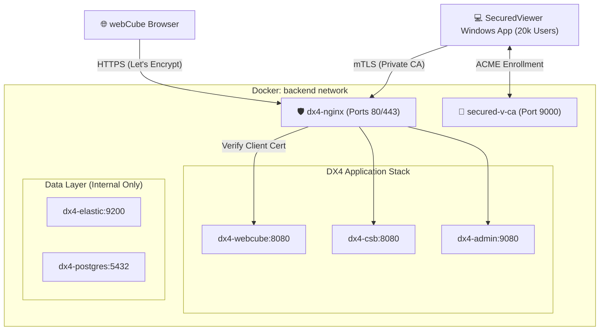

# Securing Doxis webCube HTML5Viewer: Dual-Trust NGINX Reverse Proxy with Automated mTLS Enrollment
By using a "dual-trust" approach, users get the best of both worlds: a seamless browser experience for regular webCube (via Let's Encrypt) and a cryptographically gated "VIP entrance" for the SecuredViewer Windows application (via `secured-v-ca`).

## Overview
This document describes a production-like Doxis deployment with a **Zero-Trust** layer for the SecuredViewer Windows application. 

* **Public UI:** Standard HTTPS (Let's Encrypt) for browsers.
* **App API:** Mutual TLS (mTLS) via `secured-v-ca` for the Windows client.

## Updated Architecture Diagram



---

## 1. The `secured-v-ca` Sidecar (Option C)

Add this service to your `docker-compose.yml`. We expose port `9000` so your Windows apps can reach the CA for automated enrollment.

```yaml
  secured-v-ca:
    image: smallstep/step-ca
    container_name: secured-v-ca
    ports:
      - "9000:9000"
    volumes:
      - ./step:/home/step
    environment:
      - DOCKER_STEPCA_INIT_NAME=Doxis-Internal-CA
      - DOCKER_STEPCA_INIT_DNS_NAMES=ca.dx4localdev.duckdns.org,localhost
    networks:
      - backend
    restart: always
```

---

## 2. NGINX Configuration for mTLS

We will create a specific subdomain for the SecuredViewer Windows app. This allows NGINX to demand a certificate **only** for that subdomain.

### `nginx/conf.d/secured-webcube.conf`
```nginx
server {
    listen 443 ssl;
    server_name secured-webcube.dx4localdev.duckdns.org;

    # SERVER-SIDE TLS (Publicly trusted via Let's Encrypt)
    ssl_certificate     /etc/letsencrypt/live/dx4localdev.duckdns.org/fullchain.pem;
    ssl_certificate_key /etc/letsencrypt/live/dx4localdev.duckdns.org/privkey.pem;

    # CLIENT-SIDE mTLS (Privately trusted via secured-v-ca)
    ssl_client_certificate /etc/nginx/certs/root_ca.crt; # Exported from CA container
    ssl_verify_client on; 

    location / {
        # Only proxy if the certificate is valid
        if ($ssl_client_verify != SUCCESS) {
            return 403;
        }

        proxy_pass http://dx4-webcube:8080;
        proxy_set_header Host $host;
        proxy_set_header X-Real-IP $remote_addr;
        
        # Optional: Pass the Cert serial to Doxis for logging
        proxy_set_header X-SSL-Client-Serial $ssl_client_serial;
        proxy_set_header X-SSL-Client-Verify $ssl_client_verify;
    }
}
```

---

## 3. Operational Commands (The "Action" Section)

### A. Initialize the CA
Run this once to generate your Root and Intermediate keys.
```bash
docker compose run --rm secured-v-ca step ca init \
    --name "Doxis-Internal-CA" \
    --dns "ca.dx4localdev.duckdns.org" \
    --address ":9000" \
    --provisioner "admin@dx4.local"
```

### B. Link CA to NGINX
NGINX needs to know which "Root" to trust. Copy the root cert from the CA volume to your NGINX config folder.
```bash
cp ./step/certs/root_ca.crt ./nginx/certs/root_ca.crt
docker compose restart nginx
```

### C. Automated Enrollment (20,000 Users)
Instead of manual files, your SecuredViewer Windows app should use the **ACME provisioner**. Enable it on the CA:
```bash
docker exec -it secured-v-ca step ca provisioner add acme --type ACME
```
**SecuredViewer Windows App Logic:** Your app (using a library like `Certes` for .NET or `win-acme`) points to `https://ca.dx4localdev.duckdns.org:9000/acme/acme/directory`. It will automatically fetch a certificate, install it in the Windows Store, and use it for all future requests to `secured-webcube`.

---

## 4. Resulting Security Model

| User Action | Access Point | Auth Layer 1 | Auth Layer 2 |
| :--- | :--- | :--- | :--- |
| **webCube navigation** | `admin.dx4local...` | Public SSL | Basic Auth + Doxis Login |
| **Document viewing** | `secured-webcube...` | **mTLS (Handshake)** | Doxis Login |

---
