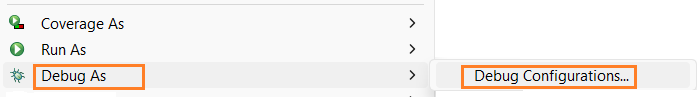

# HowTo: Enable Remote Debugging (JDWP) in Eclipse for a Jetty JVM

This guide walks through enabling **JDWP remote debugging** for a Java application (e.g., Jetty) and attaching to it from **Eclipse IDE for Enterprise Java and Web Developers**.

---

# What You Are Setting Up

You are configuring:

1. The **JVM (Jetty)** to start with the JDWP debug agent enabled.
2. **Eclipse** to attach to that running JVM via a socket.

JDWP = *Java Debug Wire Protocol*  
It is the protocol Eclipse uses to communicate with a running JVM for debugging.

---

# Prerequisites

- Eclipse IDE (tested with 2024-09 / 4.33.0)
- Java 8+ (Java 17+ recommended)
- Jetty (or any Java app you want to debug. [Doxis Agent Server](https://services.sergroup.com/documentation/api/documentations/2/485/1482/WEBHELP/APP_CSB/topics/ref_UserManual_AppReference_ConfigFiles_AgentService.html) is Jetty)
- Eclipse IDE (through OS connectivity) access to the JVM process

---

# Part 1 — Enable JDWP on the JVM (Jetty Side)

You must start the JVM with the JDWP agent enabled.

## Recommended JVM Argument (Java 9+)

```bash
-agentlib:jdwp=transport=dt_socket,server=y,suspend=n,address=*:5005
````

### What This Means

| Option                | Meaning                            |
| --------------------- | ---------------------------------- |
| `transport=dt_socket` | Use TCP socket transport           |
| `server=y`            | JVM listens for debugger to attach |
| `suspend=n`           | Do not pause on startup            |
| `address=*:5005`      | Listen on port 5005                |

---

## Example: Starting Jetty with JDWP

```bash
java -agentlib:jdwp=transport=dt_socket,server=y,suspend=n,address=*:5005 -jar start.jar
```

> Adjust according to how your Jetty server is launched.
> If the Jetty server is [Doxis Agent Server](https://services.sergroup.com/documentation/api/documentations/2/485/1482/WEBHELP/APP_CSB/topics/ref_UserManual_AppReference_ConfigFiles_AgentService.html), see the [JDWP item in the Operational Commands for a Doxis CSB deployment](../../../EdgeTerminatedSSL/DockerComposeModifications.md#operational-commands)

---

## Verify the Debug Port Is Listening

### Windows

```cmd
netstat -ano | findstr 5005
```

You should see something like:

```
TCP    127.0.0.1:5005    0.0.0.0:0    LISTENING    31328
```

### macOS/Linux

```bash
lsof -i :5005
```

If you see a Java process listening on 5005, JDWP is enabled correctly.

---

# Part 2 — Configure Eclipse to Attach

## Step 1 — Open Debug Configurations

**Menu:**

```
Debug As → Debug Configurations…
```

📸 *[Screenshot Placeholder — Debug Configurations Menu]*


---

## Step 2 — Create a Remote Java Application Configuration

1. Select **Remote Java Application**
2. Click the **New** button

📸 *[Screenshot Placeholder — Remote Java Application Selected]*

---

## Step 3 — Configure the Connection

### Connect Tab Settings

| Setting         | Value                    |
| --------------- | ------------------------ |
| Project         | Your project             |
| Connection Type | Standard (Socket Attach) |
| Host            | 127.0.0.1                |
| Port            | 5005                     |

📸 *[Screenshot Placeholder — Connect Tab Configuration]*

Click **Apply**.

---

## Step 4 — Verify Source Lookup

Go to the **Source** tab.

Ensure your project appears in the **Source Lookup Path**.

If not:

* Click **Add**
* Choose **Java Project**
* Select your project

📸 *[Screenshot Placeholder — Source Tab Configured]*

---

# Part 3 — Attach the Debugger

Click **Debug**.

If successful:

* Eclipse switches to the **Debug Perspective**
* Threads appear in the Debug view
* Breakpoints activate

📸 *[Screenshot Placeholder — Debug Perspective with Threads Visible]*

If you get a connection error:

* Verify the port
* Verify Jetty is running
* Verify firewall settings

---

# Part 4 — Confirm Breakpoints Work

1. Open a class in your project.
2. Click the left gutter to set a breakpoint.
3. Trigger that code path from Jetty.

If successful:

* Eclipse pauses execution.
* You can step through the code.
* Variables appear in the Variables view.

📸 *[Screenshot Placeholder — Breakpoint Hit]*

---

# Part 5 — Enable Hot Code Replace (Optional but Recommended)

Hot Code Replace allows updating method bodies without restarting Jetty.

## Enable It

**Menu:**

```
Window → Preferences → Java → Debug
```

Ensure:

* ✅ Enable Hot Code Replace
* ✅ Reload modified classes = Always
* ✅ Show error when hot code replace fails
* ❌ Show error when not supported (optional)
* ❌ Show error when obsolete methods remain (optional)

📸 *[Screenshot Placeholder — Hot Code Replace Preferences]*

---

## Test Hot Code Replace

1. Modify a method body.
2. Save the file.
3. Trigger the method again.

If it works:

* No restart needed.
* New behavior executes immediately.

---

# Common Issues

## 1. Eclipse Does Not Switch to Debug Perspective

Go to:

```
Window → Preferences → Run/Debug → Perspectives
```

Set:

* When a debug session starts → Switch to associated perspective

---

## 2. Breakpoints Not Binding (Hollow Circle)

Possible causes:

* Class not loaded yet
* Source mismatch
* Wrong project selected
* Different compiled version deployed

---

## 3. Hot Code Replace Fails

Typical unsupported changes:

* Adding/removing methods
* Changing method signatures
* Adding/removing fields
* Changing class hierarchy

In these cases, restart Jetty.

---

# Architecture Overview (For Reference)

```
Eclipse (Debugger / JDI)
        ↓
JDWP (Wire Protocol over TCP)
        ↓
JVM Debug Agent (-agentlib:jdwp)
        ↓
JVMTI (Inside JVM)
```

JDWP is the communication protocol between Eclipse and the running JVM.

---

# Quick Checklist

* [ ] JVM started with `-agentlib:jdwp`
* [ ] Port is listening (netstat/lsof)
* [ ] Eclipse Remote Java Application configured
* [ ] Host and Port match
* [ ] Breakpoint successfully pauses execution

---

# You Now Have Remote Debugging Enabled

Your Eclipse IDE is attached to a running JVM via JDWP, and you can:

* Set breakpoints
* Step through execution
* Inspect variables
* Use Hot Code Replace
* Resume execution

---

End of guide.

```
```
