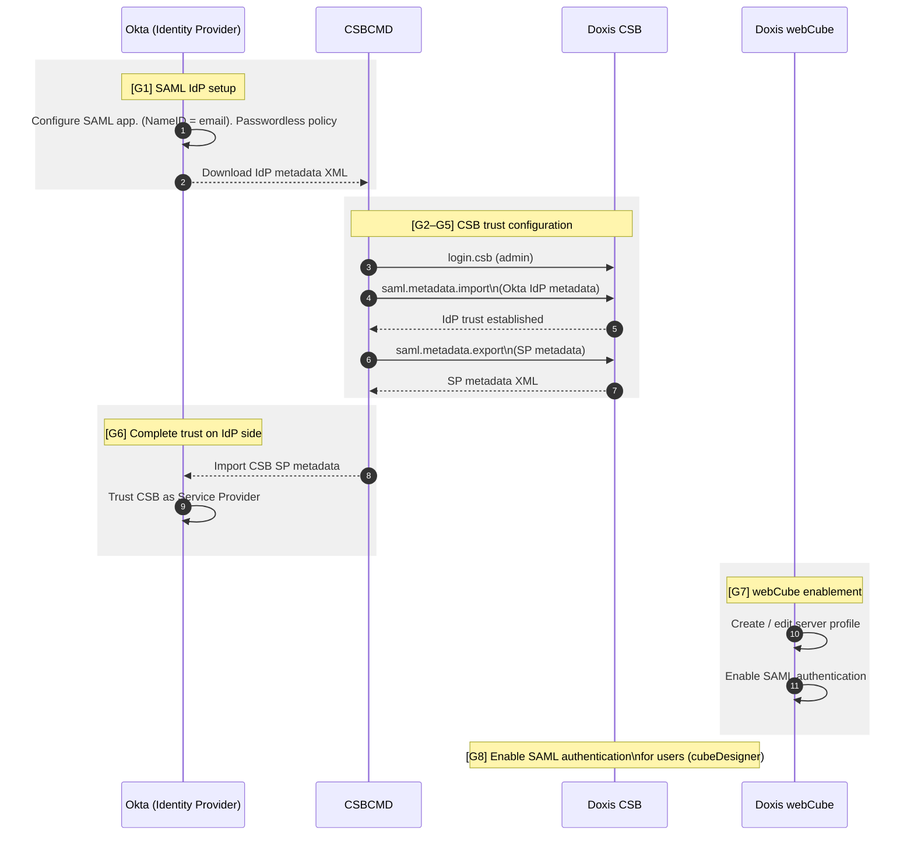
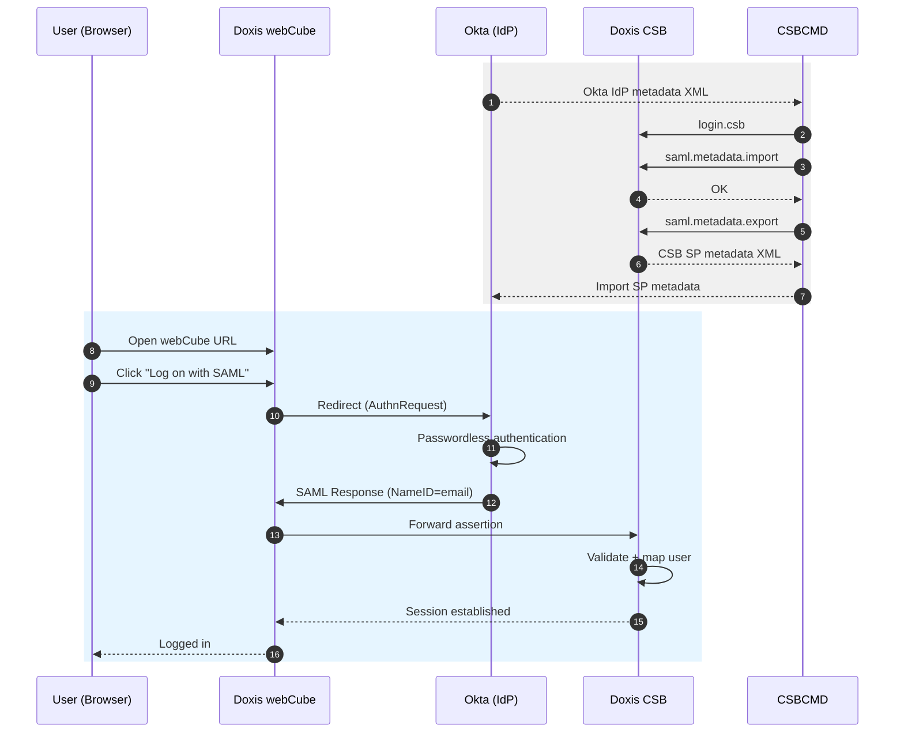

# Doxis CSB + webCube Passwordless Login via SAML (Okta)

This guide describes how to configure **passwordless SAML authentication**
for **Doxis CSB**, accessed **only through Doxis webCube**, using **Okta as the Identity Provider (IdP)**.

---

## Components involved

1. **Doxis CSB**
   - Acts as the **SAML Service Provider (SP)**
   - Validates SAML assertions and logs users in

2. **Doxis webCube**
   - Web presentation layer
   - Hosts the **Assertion Consumer Service (ACS)**
   - Redirects users to Okta and forwards assertions to CSB

3. **CSBCMD**
   - Command-line tool
   - Used to **import IdP metadata** and **export SP metadata**

4. **Okta**
   - SAML **Identity Provider (IdP)**
   - Performs passwordless authentication
   - Sends user email address as **NameID**

---

## Assumptions (explicit)

- Users **never access CSB directly**, only via webCube
- Okta sends the user's **email address as SAML NameID**
- CSB users are already created with matching email addresses
- Passwordless behavior is enforced by **Okta policy**, not by Doxis

---

## Placeholders used in this guide

| Placeholder | Meaning |
|------------|--------|
| `<CSB_HOST>` | CSB application server hostname |
| `<CSB_PORT>` | CSB application server port |
| `<CSB_ADMIN_USER>` | CSB admin username |
| `<CSB_ADMIN_PASSWORD>` | CSB admin password |
| `<CSB_ORG_NAME>` | CSB organization (customer) name |
| `<OKTA_IDP_METADATA_XML>` | Path to Okta IdP metadata XML |
| `<CSB_SP_METADATA_XML>` | Output path for CSB SP metadata XML |
| `<WEBCUBE_BASE_URL>` | `https://<webCubeURL>/webcube` |

---

## Derived URLs

```text
Assertion Consumer Service (ACS):
<WEBCUBE_BASE_URL>/ws/saml/assertion
```

## Step 1 — Configure Okta to send Email as NameID
**Component: Okta**

1. Create or select a **SAML 2.0 application** in Okta.
2. Configure the SAML settings as follows:
   - **NameID format**: EmailAddress
   - **Application username**: Email
3. Ensure the Okta authentication policy for this application is **passwordless**
   (for example: FIDO2, magic link, device-based authentication).
4. Download the **Identity Provider (IdP) metadata XML** from Okta.
5. Save the file locally as: *<OKTA_IDP_METADATA_XML>*
---

## Step 2 — Log in to CSB using CSBCMD
**Component: CSBCMD → Doxis CSB**

Establish an authenticated CSBCMD session for the target CSB organization.

    csbcmd login.csb \
      --host <CSB_HOST> \
      --port <CSB_PORT> \
      --user <CSB_ADMIN_USER> \
      --password <CSB_ADMIN_PASSWORD> \
      --customer <CSB_ORG_NAME>

This login is required before running any SAML-related CSBCMD commands.

---

## Step 3 — Import Okta IdP Metadata into CSB
**Component: CSBCMD → Doxis CSB**

Import the Okta IdP metadata to establish trust between CSB (Service Provider)
and Okta (Identity Provider).

    csbcmd saml.metadata.import \
      --file <OKTA_IDP_METADATA_XML>

Notes:
- This step must be completed **before** exporting CSB SP metadata.
- The import is organization-specific.

---

## Step 4 — Configure SAML SSO in CSB
**Component: Doxis CSB (Admin Client)**

1. Open the **Doxis Admin Client**.
2. Log on to the target CSB organization.
3. Navigate to:
```
    Configuration
    └─ Configuration of services
       └─ SAML SSO
```

4. Configure the following fields:

    * Service provider ID (EntityID):\
      `urn:doxis:csb:<CSB_ORG_NAME>`

    * Assertion consumer service URLs:\
      `<WEBCUBE_BASE_URL>/ws/saml/assertion`

    * Logon credentials in assertion:\
      `email#NameID`

5. Save the configuration.

---

## Step 5 — Export CSB Service Provider Metadata
**Component: CSBCMD → Doxis CSB**

Export the CSB Service Provider metadata so that Okta can trust CSB.

    csbcmd saml.metadata.export \
      --file <CSB_SP_METADATA_XML>

Notes:
- This command generates the SP metadata XML.
- The file contains the EntityID, ACS URL, and signing certificates.

---

## Step 6 — Import CSB SP Metadata into Okta
**Component: Okta**

1. Open the Okta SAML application.
2. Import the file `<CSB_SP_METADATA_XML>` as Service Provider metadata
3. Verify:
   - ACS URL matches the webCube ACS endpoint
   - EntityID matches the CSB configuration

---

## Step 7 — Enable SAML in webCube
**Component: Doxis webCube (Administration Console)**

1. Open the **webCube Administration Console**.
2. Navigate to:
```
    Configuration
    └─ Server profiles
```
3. Create or edit a server profile:
   - Configure CSB host, port, and SSL settings.
4. Under **Authentication methods**:
   - Enable SAML
5. Save and apply the server profile.

Important:
- At least one authentication method must be enabled, or users will not be able
  to log on to this organization in webCube.

---

## Step 8 — Enable SAML for CSB Users
**Component: cubeDesigner**

1. Enable the **SAML authentication method** for the relevant CSB users.
2. Ensure user email addresses match the values sent by Okta.

(Procedure intentionally omitted.)

---

## Step 9 — End-user Login Flow (Passwordless)
**Components: webCube → Okta → webCube → CSB**

1. User opens: *<WEBCUBE_BASE_URL>*

2. User selects **Log on with SAML**.
3. Browser is redirected to Okta.
4. Okta performs passwordless authentication.
5. Okta sends a SAML response:
   - Email address is provided as __NameID__.
6. webCube receives the assertion at the ACS endpoint.
7. webCube forwards the assertion to CSB.
8. CSB validates the assertion and logs the user in.

---
## Swimlane of configuration process


---

## Swimlane / Process Flow Diagram (Mermaid)



