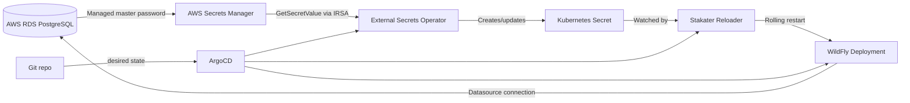

# 🔐 WildFly on EKS: Automated RDS PostgreSQL Password Rotation with IaC + ArgoCD

> **Goal:** run a WildFly-managed webapp on AWS EKS where the WildFly-managed datasource uses the current AWS RDS PostgreSQL master credentials, without Click-Ops and without manual pod restarts.

---

## ✅ Target Outcome

When AWS RDS rotates the PostgreSQL master password:

1. 🔁 RDS updates the managed master password in AWS Secrets Manager.
2. 🔎 External Secrets Operator (ESO) detects the new secret value.
3. 🔐 ESO updates a Kubernetes `Secret` in the application namespace.
4. ♻️ Stakater Reloader detects the Kubernetes `Secret` change.
5. 🚀 Reloader triggers a rolling restart of the WildFly `Deployment`.
6. 🧩 WildFly starts with the new datasource password.

No console changes. No `kubectl edit`. No manual `rollout restart`. ArgoCD deploys the Kubernetes layer.

---

## 🧭 Architecture



---

## 🧱 Components

| Layer | Tool | Responsibility |
|---|---|---|
| AWS infrastructure | Terraform | RDS, Secrets Manager integration, IAM roles, KMS, EKS access |
| Kubernetes GitOps | ArgoCD | Deploy ESO, Reloader, app manifests |
| Secret sync | External Secrets Operator | Read AWS Secrets Manager and write a Kubernetes `Secret` |
| Restart automation | Stakater Reloader | Roll WildFly pods when the Kubernetes `Secret` changes |
| Runtime | WildFly | Uses env-backed datasource credentials on startup |

---

## ⚠️ Important Security Note

Using the **RDS master user** directly from an application is usually not ideal. Prefer a least-privilege application database user when possible.

This walkthrough follows the requested scenario: the WildFly datasource uses the RDS-managed master credential. If you later move to an application user, the same Kubernetes pattern still applies; only the AWS secret source changes.

---

## 📁 Git Repository Layout

```text
repo/
├── terraform/
│   ├── main.tf
│   ├── rds.tf
│   ├── iam-irsa.tf
│   ├── outputs.tf
│   └── variables.tf
└── k8s/
    ├── argocd/
    │   ├── app-platform.yaml
    │   └── app-wildfly.yaml
    ├── platform/
    │   ├── external-secrets.yaml
    │   └── reloader.yaml
    └── wildfly/
        ├── namespace.yaml
        ├── service-account.yaml
        ├── secret-store.yaml
        ├── external-secret.yaml
        ├── configmap-wildfly-cli.yaml
        ├── deployment.yaml
        └── service.yaml
```

---

## 1️⃣ Provision RDS with Managed Master Password

AWS RDS can manage the master user password in AWS Secrets Manager. RDS generates the password, stores it in Secrets Manager, and rotates it on a schedule. AWS documentation states that RDS-managed secrets rotate every seven days by default, and the schedule can be modified.

### `terraform/rds.tf`

```hcl
resource "aws_kms_key" "rds_secret" {
  description             = "KMS key for RDS managed master secret"
  deletion_window_in_days = 30
  enable_key_rotation     = true
}

resource "aws_db_subnet_group" "postgres" {
  name       = "wildfly-postgres"
  subnet_ids = var.private_subnet_ids
}

resource "aws_security_group" "postgres" {
  name        = "wildfly-postgres"
  description = "PostgreSQL access from EKS workloads"
  vpc_id      = var.vpc_id
}

resource "aws_security_group_rule" "postgres_from_eks" {
  type                     = "ingress"
  from_port                = 5432
  to_port                  = 5432
  protocol                 = "tcp"
  security_group_id        = aws_security_group.postgres.id
  source_security_group_id = var.eks_worker_security_group_id
}

resource "aws_db_instance" "postgres" {
  identifier = "wildfly-postgres"

  engine         = "postgres"
  engine_version = var.postgres_engine_version
  instance_class = var.db_instance_class

  allocated_storage     = 100
  storage_encrypted     = true
  db_name               = "appdb"
  username              = "masteruser"
  port                  = 5432

  db_subnet_group_name   = aws_db_subnet_group.postgres.name
  vpc_security_group_ids = [aws_security_group.postgres.id]

  manage_master_user_password   = true
  master_user_secret_kms_key_id = aws_kms_key.rds_secret.arn

  backup_retention_period = 7
  deletion_protection     = true
  skip_final_snapshot     = false

  tags = {
    App = "wildfly"
  }
}
```

### `terraform/outputs.tf`

```hcl
output "rds_endpoint" {
  value = aws_db_instance.postgres.address
}

output "rds_port" {
  value = aws_db_instance.postgres.port
}

output "rds_database_name" {
  value = aws_db_instance.postgres.db_name
}

output "rds_master_secret_arn" {
  value     = aws_db_instance.postgres.master_user_secret[0].secret_arn
  sensitive = true
}
```

---

## 2️⃣ Create IAM Role for ESO via IRSA

ESO needs permission to read only the RDS-managed secret.

### `terraform/iam-irsa.tf`

```hcl
locals {
  namespace       = "wildfly"
  service_account = "wildfly-secret-reader"
}

data "aws_iam_policy_document" "eso_assume_role" {
  statement {
    effect = "Allow"

    actions = ["sts:AssumeRoleWithWebIdentity"]

    principals {
      type        = "Federated"
      identifiers = [var.eks_oidc_provider_arn]
    }

    condition {
      test     = "StringEquals"
      variable = "${var.eks_oidc_provider_url_without_https}:sub"
      values   = ["system:serviceaccount:${local.namespace}:${local.service_account}"]
    }

    condition {
      test     = "StringEquals"
      variable = "${var.eks_oidc_provider_url_without_https}:aud"
      values   = ["sts.amazonaws.com"]
    }
  }
}

resource "aws_iam_role" "wildfly_secret_reader" {
  name               = "wildfly-rds-secret-reader"
  assume_role_policy = data.aws_iam_policy_document.eso_assume_role.json
}

data "aws_iam_policy_document" "wildfly_secret_reader" {
  statement {
    sid    = "ReadRdsManagedSecret"
    effect = "Allow"

    actions = [
      "secretsmanager:GetSecretValue",
      "secretsmanager:DescribeSecret"
    ]

    resources = [aws_db_instance.postgres.master_user_secret[0].secret_arn]
  }

  statement {
    sid    = "DecryptRdsSecret"
    effect = "Allow"

    actions = ["kms:Decrypt"]

    resources = [aws_kms_key.rds_secret.arn]
  }
}

resource "aws_iam_policy" "wildfly_secret_reader" {
  name   = "wildfly-rds-secret-reader"
  policy = data.aws_iam_policy_document.wildfly_secret_reader.json
}

resource "aws_iam_role_policy_attachment" "wildfly_secret_reader" {
  role       = aws_iam_role.wildfly_secret_reader.name
  policy_arn = aws_iam_policy.wildfly_secret_reader.arn
}

output "wildfly_secret_reader_role_arn" {
  value = aws_iam_role.wildfly_secret_reader.arn
}
```

---

## 3️⃣ Deploy Platform Controllers with ArgoCD

Install both controllers declaratively through ArgoCD.

### `k8s/argocd/app-platform.yaml`

```yaml
apiVersion: argoproj.io/v1alpha1
kind: Application
metadata:
  name: platform-secret-automation
  namespace: argocd
spec:
  project: default
  source:
    repoURL: https://github.com/YOUR_ORG/YOUR_REPO.git
    targetRevision: main
    path: k8s/platform
  destination:
    server: https://kubernetes.default.svc
    namespace: platform
  syncPolicy:
    automated:
      prune: true
      selfHeal: true
    syncOptions:
      - CreateNamespace=true
```

### `k8s/platform/external-secrets.yaml`

```yaml
apiVersion: argoproj.io/v1alpha1
kind: Application
metadata:
  name: external-secrets
  namespace: argocd
  annotations:
    argocd.argoproj.io/sync-wave: "0"
spec:
  project: default
  source:
    repoURL: https://charts.external-secrets.io
    chart: external-secrets
    targetRevision: 0.10.7
    helm:
      values: |
        installCRDs: true
  destination:
    server: https://kubernetes.default.svc
    namespace: external-secrets
  syncPolicy:
    automated:
      prune: true
      selfHeal: true
    syncOptions:
      - CreateNamespace=true
```

### `k8s/platform/reloader.yaml`

```yaml
apiVersion: argoproj.io/v1alpha1
kind: Application
metadata:
  name: reloader
  namespace: argocd
  annotations:
    argocd.argoproj.io/sync-wave: "1"
spec:
  project: default
  source:
    repoURL: https://stakater.github.io/stakater-charts
    chart: reloader
    targetRevision: 1.0.121
    helm:
      values: |
        reloader:
          watchGlobally: true
  destination:
    server: https://kubernetes.default.svc
    namespace: reloader
  syncPolicy:
    automated:
      prune: true
      selfHeal: true
    syncOptions:
      - CreateNamespace=true
```

> 🔎 Pin chart versions according to your internal dependency policy. The versions above are examples.

---

## 4️⃣ Deploy WildFly App Through ArgoCD

### `k8s/argocd/app-wildfly.yaml`

```yaml
apiVersion: argoproj.io/v1alpha1
kind: Application
metadata:
  name: wildfly-app
  namespace: argocd
spec:
  project: default
  source:
    repoURL: https://github.com/YOUR_ORG/YOUR_REPO.git
    targetRevision: main
    path: k8s/wildfly
  destination:
    server: https://kubernetes.default.svc
    namespace: wildfly
  syncPolicy:
    automated:
      prune: true
      selfHeal: true
    syncOptions:
      - CreateNamespace=true
```

---

## 5️⃣ Create Namespace and ServiceAccount

### `k8s/wildfly/namespace.yaml`

```yaml
apiVersion: v1
kind: Namespace
metadata:
  name: wildfly
```

### `k8s/wildfly/service-account.yaml`

Replace `ROLE_ARN_FROM_TERRAFORM_OUTPUT` with `wildfly_secret_reader_role_arn` from Terraform.

```yaml
apiVersion: v1
kind: ServiceAccount
metadata:
  name: wildfly-secret-reader
  namespace: wildfly
  annotations:
    eks.amazonaws.com/role-arn: ROLE_ARN_FROM_TERRAFORM_OUTPUT
```

---

## 6️⃣ Define the AWS SecretStore

### `k8s/wildfly/secret-store.yaml`

```yaml
apiVersion: external-secrets.io/v1beta1
kind: SecretStore
metadata:
  name: aws-secrets-manager
  namespace: wildfly
spec:
  provider:
    aws:
      service: SecretsManager
      region: us-east-1
      auth:
        jwt:
          serviceAccountRef:
            name: wildfly-secret-reader
```

---

## 7️⃣ Sync the RDS Secret into Kubernetes

RDS-managed Secrets Manager values are JSON. For PostgreSQL, expect fields such as `username`, `password`, `host`, `port`, and database metadata.

### `k8s/wildfly/external-secret.yaml`

Replace `RDS_MASTER_SECRET_ARN_FROM_TERRAFORM_OUTPUT` with `rds_master_secret_arn` from Terraform.

```yaml
apiVersion: external-secrets.io/v1beta1
kind: ExternalSecret
metadata:
  name: wildfly-rds-postgres
  namespace: wildfly
spec:
  refreshInterval: 1m
  secretStoreRef:
    name: aws-secrets-manager
    kind: SecretStore
  target:
    name: wildfly-rds-postgres
    creationPolicy: Owner
  data:
    - secretKey: DB_USERNAME
      remoteRef:
        key: RDS_MASTER_SECRET_ARN_FROM_TERRAFORM_OUTPUT
        property: username
    - secretKey: DB_PASSWORD
      remoteRef:
        key: RDS_MASTER_SECRET_ARN_FROM_TERRAFORM_OUTPUT
        property: password
    - secretKey: DB_HOST
      remoteRef:
        key: RDS_MASTER_SECRET_ARN_FROM_TERRAFORM_OUTPUT
        property: host
    - secretKey: DB_PORT
      remoteRef:
        key: RDS_MASTER_SECRET_ARN_FROM_TERRAFORM_OUTPUT
        property: port
```

---

## 8️⃣ Configure the WildFly Managed Datasource

This approach configures the datasource at container startup using the WildFly CLI. The password is read from environment variables populated by the Kubernetes `Secret`.

### `k8s/wildfly/configmap-wildfly-cli.yaml`

```yaml
apiVersion: v1
kind: ConfigMap
metadata:
  name: wildfly-datasource-cli
  namespace: wildfly
data:
  configure-datasource.cli: |
    embed-server --server-config=standalone.xml --std-out=echo

    batch

    /subsystem=datasources/jdbc-driver=postgresql:add(
      driver-name=postgresql,
      driver-module-name=org.postgresql,
      driver-class-name=org.postgresql.Driver
    )

    /subsystem=datasources/data-source=AppDS:add(
      jndi-name=java:/jdbc/AppDS,
      driver-name=postgresql,
      connection-url="jdbc:postgresql://${env.DB_HOST}:${env.DB_PORT}/appdb",
      user-name="${env.DB_USERNAME}",
      password="${env.DB_PASSWORD}",
      min-pool-size=5,
      max-pool-size=30,
      enabled=true,
      validate-on-match=true,
      background-validation=true,
      background-validation-millis=30000,
      check-valid-connection-sql="select 1"
    )

    run-batch
    stop-embedded-server
```

> 🧩 Ensure the PostgreSQL JDBC driver is available in the WildFly image. The preferred production pattern is to bake the driver module into the image rather than downloading it at runtime.

---

## 9️⃣ Deploy WildFly with Secret-Driven Rolling Restart

### `k8s/wildfly/deployment.yaml`

```yaml
apiVersion: apps/v1
kind: Deployment
metadata:
  name: wildfly-webapp
  namespace: wildfly
  annotations:
    reloader.stakater.com/auto: "true"
spec:
  replicas: 3
  revisionHistoryLimit: 5
  strategy:
    type: RollingUpdate
    rollingUpdate:
      maxUnavailable: 0
      maxSurge: 1
  selector:
    matchLabels:
      app: wildfly-webapp
  template:
    metadata:
      labels:
        app: wildfly-webapp
    spec:
      serviceAccountName: wildfly-secret-reader
      terminationGracePeriodSeconds: 60
      containers:
        - name: wildfly
          image: YOUR_REGISTRY/wildfly-webapp:YOUR_TAG
          imagePullPolicy: IfNotPresent
          ports:
            - name: http
              containerPort: 8080
            - name: management
              containerPort: 9990
          envFrom:
            - secretRef:
                name: wildfly-rds-postgres
          env:
            - name: JAVA_OPTS_APPEND
              value: >-
                -Djboss.bind.address=0.0.0.0
                -Djboss.bind.address.management=0.0.0.0
          volumeMounts:
            - name: datasource-cli
              mountPath: /opt/wildfly/startup/configure-datasource.cli
              subPath: configure-datasource.cli
          command:
            - /bin/sh
            - -c
          args:
            - |
              set -eu
              /opt/wildfly/bin/jboss-cli.sh --file=/opt/wildfly/startup/configure-datasource.cli
              exec /opt/wildfly/bin/standalone.sh -b 0.0.0.0
          readinessProbe:
            httpGet:
              path: /health/ready
              port: 8080
            initialDelaySeconds: 30
            periodSeconds: 10
            failureThreshold: 6
          livenessProbe:
            httpGet:
              path: /health/live
              port: 8080
            initialDelaySeconds: 60
            periodSeconds: 20
            failureThreshold: 3
      volumes:
        - name: datasource-cli
          configMap:
            name: wildfly-datasource-cli
```

### `k8s/wildfly/service.yaml`

```yaml
apiVersion: v1
kind: Service
metadata:
  name: wildfly-webapp
  namespace: wildfly
spec:
  selector:
    app: wildfly-webapp
  ports:
    - name: http
      port: 80
      targetPort: 8080
```

---

## 🔁 Rotation Flow in Detail

### Runtime timeline

```text
T0    RDS rotates master password in Secrets Manager
T0+   ESO refresh interval elapses
T0+   ESO updates Kubernetes Secret wildfly-rds-postgres
T0+   Reloader detects Secret resourceVersion/data change
T0+   Reloader patches WildFly Deployment pod template annotation
T0+   Kubernetes creates new ReplicaSet
T0+   WildFly pods restart one at a time
T0+   New pods boot with current DB password
```

### Why a restart is required

Environment variables are resolved when the container starts. Updating a Kubernetes `Secret` does not rewrite already-running container environment variables. A new pod is required for WildFly to receive the new value.

---

## 🧪 Validation

### Confirm RDS has a managed secret

```bash
terraform output rds_master_secret_arn
```

### Confirm ESO created the Kubernetes Secret

```bash
kubectl -n wildfly get secret wildfly-rds-postgres
```

### Confirm the deployment is annotated for Reloader

```bash
kubectl -n wildfly get deploy wildfly-webapp -o jsonpath='{.metadata.annotations}'
```

### Force ESO reconciliation without Click-Ops drift

This is acceptable for a break-glass test, but do not make it the steady-state operating model.

```bash
kubectl -n wildfly annotate externalsecret wildfly-rds-postgres force-sync=$(date +%s) --overwrite
```

### Watch rollout

```bash
kubectl -n wildfly rollout status deployment/wildfly-webapp
```

### Confirm new pods see the current secret

```bash
kubectl -n wildfly get pods -l app=wildfly-webapp
kubectl -n wildfly describe deploy wildfly-webapp | grep -i reloader -A3
```

---

## 🛡️ Production Hardening

### 🔐 IAM

- Scope `secretsmanager:GetSecretValue` to the exact RDS secret ARN.
- Scope `kms:Decrypt` to the exact KMS key used for the RDS secret.
- Use one IRSA role per application or trust boundary.
- Do not grant wildcard access to all Secrets Manager secrets.

### 🧬 GitOps

- ArgoCD should deploy controllers and manifests.
- Do not commit database passwords to Git.
- Do not commit rendered Kubernetes `Secret` values.
- Use pinned Helm chart versions.
- Use separate ArgoCD applications for platform controllers and application workloads.

### ♻️ Rollout safety

- Use at least two WildFly replicas.
- Set `maxUnavailable: 0` for rotation-induced restarts.
- Configure readiness probes so traffic only reaches pods with a working datasource.
- Use PodDisruptionBudgets for voluntary disruptions.
- Ensure the datasource validates connections before accepting traffic.

### 🗄️ Database

- Prefer a least-privilege app user over the master user when feasible.
- Keep old database connections short-lived enough that stale password sessions drain quickly.
- Ensure the WildFly connection pool validates connections and recovers from invalid credentials.
- Monitor RDS authentication failures after each rotation.

### 📊 Observability

Alert on:

- ESO sync failures.
- Reloader failures.
- WildFly rollout failures.
- Pods stuck in `CrashLoopBackOff`.
- RDS PostgreSQL authentication failures.
- ArgoCD application `OutOfSync` or `Degraded` status.

---

## 🚫 What This Design Avoids

- ❌ No manual AWS Console secret lookup.
- ❌ No manual Kubernetes `Secret` edits.
- ❌ No manual `kubectl rollout restart`.
- ❌ No committing passwords to Git.
- ❌ No application image rebuild for each password rotation.

---

## 🧩 Optional: Event-Driven Restart Instead of Polling

The ESO + Reloader design is usually simpler and more GitOps-friendly. If the rotation interval is very short and one-minute polling is not acceptable, an event-driven pattern can be added:

1. EventBridge detects successful Secrets Manager/RDS password rotation.
2. Lambda authenticates to EKS.
3. Lambda patches the `ExternalSecret` annotation or the WildFly `Deployment` pod template annotation.
4. Kubernetes performs a rollout.

Use this only if polling delay is unacceptable. It adds IAM, Lambda, and Kubernetes API operational complexity.

---

## ✅ Definition of Done

- [ ] RDS PostgreSQL uses `manage_master_user_password = true`.
- [ ] Terraform outputs the RDS managed secret ARN.
- [ ] ESO is deployed by ArgoCD.
- [ ] Reloader is deployed by ArgoCD.
- [ ] IRSA allows ESO to read only the required RDS secret.
- [ ] `ExternalSecret` creates `wildfly-rds-postgres` in the `wildfly` namespace.
- [ ] WildFly datasource reads credentials from environment variables.
- [ ] WildFly deployment has Reloader annotation.
- [ ] Rotation causes a rolling restart without manual action.
- [ ] Readiness/liveness probes prevent bad pods from receiving traffic.

---

## 📚 References

- AWS RDS password management with AWS Secrets Manager: https://docs.aws.amazon.com/AmazonRDS/latest/UserGuide/rds-secrets-manager.html
- AWS Secrets Manager database rotation: https://docs.aws.amazon.com/secretsmanager/latest/userguide/rotate-secrets_turn-on-for-db.html
- External Secrets Operator: https://external-secrets.io/
- ExternalSecret update behavior: https://external-secrets.io/latest/introduction/faq/
- Stakater Reloader: https://github.com/stakater/Reloader
- ArgoCD sync waves and hooks: https://argo-cd.readthedocs.io/en/stable/user-guide/sync-waves/
- Kubernetes rollout restart reference: https://kubernetes.io/docs/reference/kubectl/generated/kubectl_rollout/kubectl_rollout_restart/
